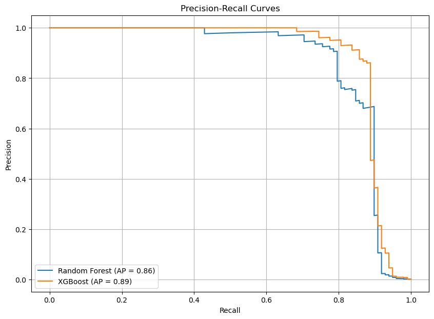

# Credit Card Fraud Detection

## Project Overview

This project aims to develop a robust fraud detection model to identify fraudulent transactions within a highly imbalanced dataset. Using advanced machine learning techniques and comprehensive data analysis, we created a model that can effectively distinguish between genuine and fraudulent transactions, providing enhanced security and reliability for financial transactions.

## Key Features

- **Data Preprocessing**:
  - Applied log transformation to the `Amount` feature to reduce skewness.
  - Standardized features using `RobustScaler` for consistent scaling.
  - Addressed class imbalance with SMOTE (Synthetic Minority Over-sampling Technique).

- **Exploratory Data Analysis (EDA)**:
  - Visualizations like histograms, pairplots, and heatmaps demonstrate feature distributions and relationships.
  - Identified key patterns and insights that differentiate fraudulent transactions from non-fraudulent ones.

- **Model Selection and Hyperparameter Tuning**:
  - Evaluated basic Logistic Regression, Random Forest, Gradient Boosting, and XGBoost models.
  - Used GridSearchCV for hyperparameter tuning with Random Forest and XGBoost, optimizing for average precision.

- **Model Performance Evaluation**:
  - Compared models based on metrics like precision-recall AUC, and F1-score.
  - Visualized performance using ROC and precision-recall curves.

- **Final Model Selection**:
  - Selected **XGBoost** as the final model due to its superior balance of precision and recall, achieving an excellent Precision-Recall AUC of 0.89 and the best F1 score among tuned models.

## Practical Implications

- **High Accuracy and Reliability**: The XGBoost classifier is highly accurate and reliable for detecting fraudulent transactions. This ensures that genuine transactions are processed smoothly while effectively catching most fraud cases.
- **Customer Confidence**: Provides customers with a reliable system that minimizes interruptions to legitimate transactions.
- **Continuous Improvement**: Emphasizes the need for ongoing monitoring and enhancement to adapt to new fraud patterns.

## Final Model: XGBoost

### Precision-Recall Curves (tuned models)

### Confusion Matrix

## Future Work

- **Tuning Enhancement**: Further tuning and evaluating additional hyperparameters.
- **Ensemble Methods**: Exploring combinations of multiple models for better results.