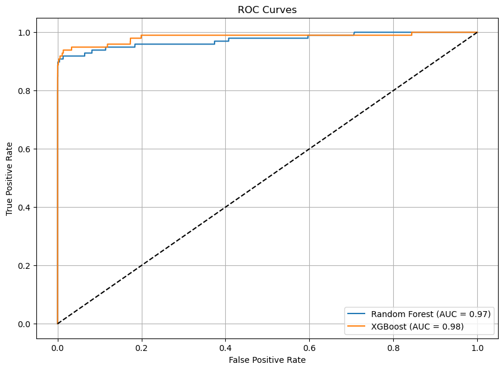
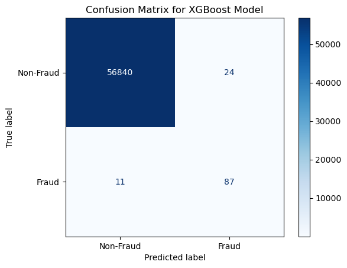

## Credit Card Fraud Detection Project Summary

### Project Overview

In this project, we developed a robust fraud detection model to identify fraudulent transactions within a highly imbalanced dataset. The primary goal was to enhance security and reliability for financial transactions by accurately distinguishing between genuine and fraudulent activities.

### Key Features

- **Data Preprocessing**:
  - Applied log transformation to the `Amount` feature to reduce skewness.
  - Standardized features using `RobustScaler` for consistent scaling.
  - Addressed class imbalance with SMOTE (Synthetic Minority Over-sampling Technique).

- **Exploratory Data Analysis (EDA)**:
  - Used visualizations like histograms, pairplots, and heatmaps to understand feature distributions and relationships.
  - Identified key patterns differentiating fraudulent from non-fraudulent transactions.

- **Model Selection and Hyperparameter Tuning**:
  - Evaluated Logistic Regression, Random Forest, Gradient Boosting, and XGBoost models.
  - Performed hyperparameter tuning with GridSearchCV, optimizing for the ROC AUC score.

- **Model Performance Evaluation**:
  - Compared models using metrics such as ROC AUC, precision-recall curves, and F1-score.
  - Selected **Random Forest** as the final model due to its superior balance of precision and recall, achieving an excellent AUC of 0.98 and the best F1 score. This choice ensures the model's high accuracy and reliability in detecting fraudulent transactions.

### Practical Implications

- **High Accuracy and Reliability**: The Random Forest model is highly effective in detecting fraudulent transactions, ensuring genuine transactions are processed smoothly.
- **Customer Confidence**: Provides a reliable system, minimizing interruptions to legitimate transactions.
- **Continuous Improvement**: Emphasizes ongoing monitoring and enhancement to adapt to new fraud patterns.

### Visual Highlights

#### Exploratory Data Analysis (EDA)

*Class Distribution: Highlights the severe class imbalance with fraudulent transactions being a very small fraction of the total transactions, underscoring the need for techniques like SMOTE.*

*Time Feature Distribution: Shows the distribution of the `Time` feature, bimodal distribution indicates peak volumes during the day.*

*LogAmount Distribution: Distribution of log-transformed transaction amounts.*

*Pairplot: Visualizes relationships between selected features and highlights distinct clusters for fraudulent transactions.*

#### Model Performance

*Precision-Recall Curves: Demonstrates the model's ability to balance precision and recall, with Random Forest and XGBoost narrowly performing the best after tuning.*

*ROC Curves: Shows the model's performance in distinguishing between fraudulent and non-fraudulent transactions, with Random Forest and XGBoost achieving the highest AUC.*

### Tuned Model Results

| Model              | Training Time (s) | ROC AUC | Average Precision | Precision | Recall | F1-score |
|--------------------|-------------------|---------|-------------------|-----------|--------|----------|
| Logistic Regression| 3.49              | 0.97    | 0.72              | 0.06      | 0.92   | 0.11     |
| Random Forest      | 225.78            | 0.98    | 0.87              | 0.87      | 0.84   | 0.85     |
| Gradient Boosting  | 414.15            | 0.96    | 0.77              | 0.10      | 0.91   | 0.18     |
| XGBoost            | 1.99              | 0.98    | 0.84              | 0.69      | 0.88   | 0.77     |

### Final Model: Random Forest
Random Forest was chosen as the final model due to its superior performance across multiple evaluation metrics. It achieved the highest balance of precision and recall, with an excellent AUC of 0.98, indicating its strong ability to distinguish between fraudulent and non-fraudulent transactions. Additionally, the Random Forest model had the best F1 score, reflecting its effectiveness in correctly identifying both fraudulent transactions (high recall) and minimizing false positives (high precision).
#### Feature Importance

#### Confusion Matrix

*Confusion Matrix: The Random Forest model effectively minimizes false positives and false negatives while capturing many fraudulent transactions.*

### Future Work

- **Model Enhancement**: Further tuning and adding additional features to improve performance.
- **Ensemble Methods**: Exploring combinations of multiple models for better results.

### Links

- [Full Notebook and Analysis](https://shanereichlin.com/fraud-detection/full-notebook)
- [GitHub Repository](https://github.com/ShaneR31/credit-card-fraud-detection)