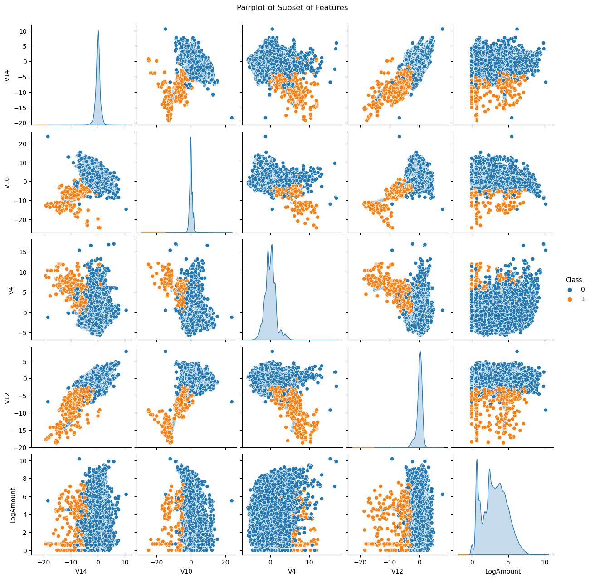

## Credit Card Fraud Detection Project Summary

### Project Overview

In this project, we developed a robust fraud detection model to identify fraudulent transactions within a highly imbalanced dataset. The primary goal was to enhance security and reliability for financial transactions by accurately distinguishing between genuine and fraudulent activities.

### Key Features

- **Data Preprocessing**:
  - Applied log transformation to the `Amount` feature to reduce skewness.
  - Standardized features using `RobustScaler` for consistent scaling.
  - Addressed class imbalance with SMOTE (Synthetic Minority Over-sampling Technique).

- **Exploratory Data Analysis (EDA)**:
  - Used visualizations like histograms, pairplots, and heatmaps to understand feature distributions and relationships.
  - Identified key patterns differentiating fraudulent from non-fraudulent transactions.

- **Model Selection and Hyperparameter Tuning**:
  - Evaluated basic Logistic Regression, Random Forest, Gradient Boosting, and XGBoost models.
  - Performed hyperparameter tuning with Random Forest and XGBoost models, optimizing for average precision.

- **Model Performance Evaluation**:
  - Compared models using metrics such as ROC AUC, precision-recall AUC, and F1-score.
  - Selected **XGBoost** as the final model due to its superior balance of precision and recall, achieving an excellent Precision-Recall AUC of 0.89 and the best F1 score among tuned models. This choice ensures the model's high accuracy and reliability in detecting fraudulent transactions.

### Practical Implications

- **High Accuracy and Reliability**: The XGBoost model is highly effective in detecting fraudulent transactions, ensuring genuine transactions are processed smoothly.
- **Customer Confidence**: Provides a reliable system, minimizing interruptions to legitimate transactions.
- **Continuous Improvement**: Emphasizes ongoing monitoring and enhancement to adapt to new fraud patterns.

### Visual Highlights

#### Exploratory Data Analysis (EDA)

*Class Distribution: Highlights the severe class imbalance with fraudulent transactions being a very small fraction of the total transactions, underscoring the need for techniques like SMOTE.*

*Time Feature Distribution: Shows the distribution of the `Time` feature, bimodal distribution indicates peak volumes during the day.*

*LogAmount Distribution: Distribution of log-transformed transaction amounts.*

*Pairplot: Visualizes relationships between selected features and highlights distinct clusters for fraudulent transactions.*

#### Model Performance

*Precision-Recall Curves: Demonstrates the model's ability to balance precision and recall, with XGBoost performing the best after tuning.*

*ROC Curves: Shows the model's performance in distinguishing between fraudulent and non-fraudulent transactions, with XGBoost achieving the highest AUC.*

### Tuned Model Results

| Model              | Training Time (s) | ROC AUC | Average Precision | PRC AUC | Precision | Recall | F1-score |
|--------------------|-------------------|---------|-------------------|---------|-----------|--------|----------|
| Random Forest      | 488.24            | 0.97    | 0.86              | 0.86    | 0.73      | 0.85   | 0.79     |
| XGBoost            | 3.72              | 0.98    | 0.89              | 0.89    | 0.78      | 0.88   | 0.83     |

### Final Model: XGBoost
XGBoost was chosen as the final model due to its superior performance in balancing precision and recall, ensuring reliable fraud detection with minimal false positives. It demonstrated a higher Precision-Recall AUC and better f1-score compared to other models, indicating its effectiveness in identifying fraudulent transactions while maintaining accuracy. Additionally, XGBoost's significantly shorter training time makes it more efficient for real-world applications where quick model updates and deployment are crucial.

#### Confusion Matrix

*Confusion Matrix: The XGBoost classifier effectively minimizes false positives and false negatives while capturing many fraudulent transactions.*

### Future Work

- **Model Enhancement**: Further tuning and adding additional features to improve performance.
- **Ensemble Methods**: Exploring combinations of multiple models for better results.

### Links

- [Full Notebook and Analysis](https://shanereichlin.com/fraud-detection/full-notebook)
- [GitHub Repository](https://github.com/ShaneR31/credit-card-fraud-detection)